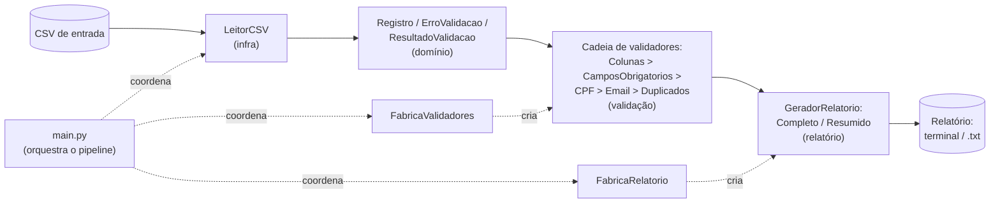
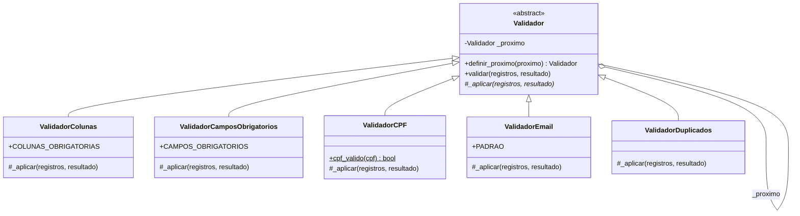
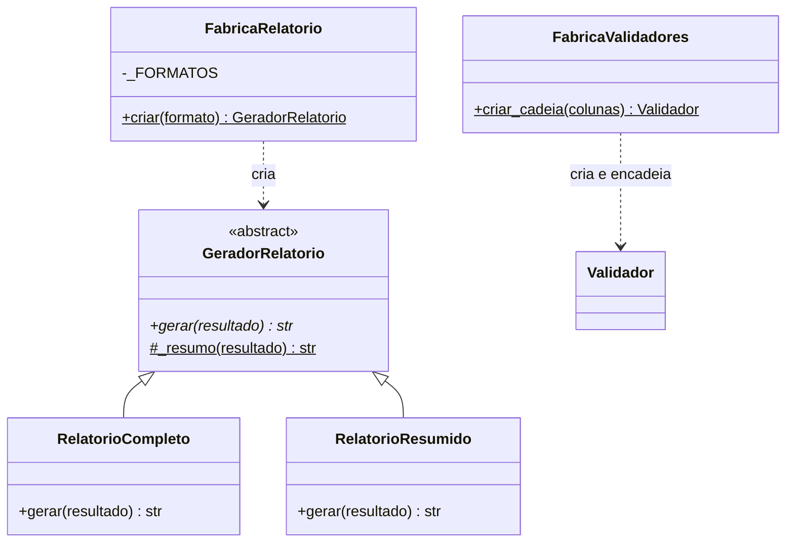

# Arquitetura e Padrões de Projeto

> **Sprint 2: Projeto da Aplicação.** Este documento descreve a arquitetura (com trade-offs justificados), os dois padrões de projeto com **classes reais do código** e a demonstração funcional no terminal. Os padrões de codificação e de qualidade estão em [`padroes_codificacao.md`](padroes_codificacao.md).

## 1. Visão Geral da Arquitetura

O ValidaCad combina **arquitetura em camadas** com um **pipeline de validação**: a entrada percorre etapas de responsabilidade bem separada, da leitura do CSV até a geração do relatório.

```txt
CSV > Carregamento > Objetos de domínio > Cadeia de validadores > Agregação de erros > Relatório
```

### Diagrama de componentes



### Responsabilidades por componente

| Camada / Módulo | Componente (classe) | Responsabilidade |
| --- | --- | --- |
| Infraestrutura, `infra/leitor_csv.py` | `LeitorCSV` | Ler o `.csv` e converter cada linha em um `Registro` |
| Domínio, `dominio/` | `Registro`, `ErroValidacao`, `Severidade`, `ResultadoValidacao` | Representar os dados e acumular erros e resumo quantitativo |
| Validação, `validacao/` | `Validador` e 5 validadores concretos | Aplicar as regras de validação (Chain of Responsibility) |
| Validação, `validacao/fabrica.py` | `FabricaValidadores` | Criar e encadear os validadores |
| Relatório, `relatorio/` | `GeradorRelatorio`, `RelatorioCompleto`, `RelatorioResumido` | Formatar a saída |
| Relatório, `relatorio/fabrica.py` | `FabricaRelatorio` | Escolher o gerador conforme o formato pedido |
| Orquestração, `main.py` | `executar` e `main` | Coordenar o pipeline e tratar a linha de comando |

### Decisões e trade-offs justificados

| Decisão | Prós | Contras | Por que aceitamos |
| --- | --- | --- | --- |
| **Camadas e pipeline** | Responsabilidades separadas; cada etapa testável isoladamente; baixo acoplamento (RNF06) | Mais arquivos e indireção para um sistema pequeno | O foco da disciplina é qualidade de engenharia; a estrutura se paga em manutenibilidade e testabilidade |
| **Chain of Responsibility na validação** | Adicionar, remover ou reordenar regras sem tocar nas existentes (Aberto/Fechado, RNF04); cada regra isolada | Percorre a cadeia inteira mesmo após encontrar erros | Queremos **todos** os erros do registro, não parar no primeiro, o que combina com o objetivo do relatório |
| **Factory Method na criação** | Cliente desacoplado das classes concretas; novos formatos ou validadores entram em um único ponto | Uma classe a mais; pode parecer excesso em escala pequena | Centraliza a criação e demonstra extensibilidade real (ex.: formato JSON futuro) |
| **CSV e terminal (sem GUI nem banco)** | Simples de executar, versionar e testar; compatível com planilhas reais | Não escala para grandes volumes nem formatos ricos | Está dentro do escopo definido: "escopo pequeno e completo vale mais" |
| **Coletar todos os erros numa passada** | Relatório completo sem reexecutar | Mais processamento por registro | O usuário corrige tudo de uma vez |

## 2. Padrão 1: Chain of Responsibility

**Onde:** `codigo/validacao/`. **Problema que resolve:** o sistema tem várias regras de validação independentes que tendem a crescer; encadeá-las evita um `if/elif` gigante e mantém cada regra isolada e testável.

**Como funciona:** `Validador` é o elo abstrato. Cada validador concreto implementa `_aplicar()` (sua regra) e herda `validar()`, que executa a regra e **delega ao próximo elo** (`_proximo`). A `FabricaValidadores` define a ordem: `Colunas`, `CamposObrigatorios`, `CPF`, `Email`, `Duplicados`.



| Papel no padrão | Classe real | Arquivo |
| --- | --- | --- |
| Handler (abstrato) | `Validador` | `validacao/validador.py` |
| Handlers concretos | `ValidadorColunas`, `ValidadorCamposObrigatorios`, `ValidadorCPF`, `ValidadorEmail`, `ValidadorDuplicados` | `validacao/*.py` |
| Montagem da cadeia | `FabricaValidadores.criar_cadeia(colunas)` | `validacao/fabrica.py` |

## 3. Padrão 2: Factory Method

**Onde:** `codigo/relatorio/fabrica.py` e `codigo/validacao/fabrica.py`. **Problema que resolve:** isolar o código cliente (`main.py`) dos detalhes de instanciação. O `main` pede "um relatório no formato X" ou "a cadeia de validadores" e recebe o objeto pronto, sem conhecer as classes concretas.



| Papel no padrão | Classe real | Arquivo |
| --- | --- | --- |
| Creator (relatórios) | `FabricaRelatorio.criar(formato)` | `relatorio/fabrica.py` |
| Produto abstrato | `GeradorRelatorio` | `relatorio/relatorio.py` |
| Produtos concretos | `RelatorioCompleto`, `RelatorioResumido` | `relatorio/relatorio.py` |
| Creator (validadores) | `FabricaValidadores.criar_cadeia(colunas)` | `validacao/fabrica.py` |

> Para adicionar um formato `json`, basta criar `RelatorioJson(GeradorRelatorio)` e registrá-lo em `FabricaRelatorio._FORMATOS`; nenhuma outra parte do sistema muda. O mesmo vale para uma nova regra: cria-se um `Validador` e registra-se na `FabricaValidadores`.

## 4. Demonstração funcional no terminal

```bash
# Relatório completo (resumo e detalhamento dos erros)
python3 -m codigo.main dados/cadastros_exemplo.csv

# Apenas o resumo quantitativo
python3 -m codigo.main dados/cadastros_exemplo.csv --formato resumido

# Salvando o relatório em arquivo
python3 -m codigo.main dados/cadastros_exemplo.csv relatorios/relatorio.txt
```

Saída real do comando completo sobre `dados/cadastros_exemplo.csv` (5 registros: 2 válidos, 3 com erro, 6 inconsistências):

```txt
RELATÓRIO DE VALIDAÇÃO DE CADASTROS

Total de registros analisados: 5
Registros válidos: 2
Registros com erro: 3
Total de inconsistências encontradas: 6

ERROS ENCONTRADOS:

Linha 3
- Campo: cpf
- Erro: CPF inválido
- Valor informado: 111.111.111-11
- Severidade: crítica

Linha 3
- Campo: email
- Erro: E-mail em formato inválido
- Valor informado: mariaemail.com
- Severidade: média

Linha 4
- Campo: cpf
- Erro: CPF inválido
- Valor informado: 123.456.789-00
- Severidade: crítica

Linha 4
- Campo: nome
- Erro: Campo obrigatório vazio
- Valor informado: vazio
- Severidade: crítica

Linha 5
- Campo: cpf
- Erro: CPF duplicado
- Valor informado: 529.982.247-25
- Severidade: crítica

Linha 5
- Campo: email
- Erro: E-mail duplicado
- Valor informado: joao@email.com
- Severidade: crítica
```

### Validação de colunas (RF02)

Para demonstrar a checagem de colunas obrigatórias, o arquivo `dados/cadastros_sem_coluna.csv` não tem a coluna `email`. O problema é reportado uma vez, no nível do arquivo (cabeçalho), sem se repetir por linha:

```bash
python3 -m codigo.main dados/cadastros_sem_coluna.csv
```

```txt
RELATÓRIO DE VALIDAÇÃO DE CADASTROS

Total de registros analisados: 2
Registros válidos: 2
Registros com erro: 0
Total de inconsistências encontradas: 1

ERROS ENCONTRADOS:

Cabeçalho do arquivo
- Campo: email
- Erro: Coluna obrigatória ausente
- Valor informado: (coluna não existe no arquivo)
- Severidade: crítica
```

## 5. Status da Sprint 2 (Review 02/06)

- [x] **Diagrama de arquitetura** com componentes, responsabilidades e trade-offs justificados (seção 1)
- [x] **Diagramas dos 2 padrões** com classes e módulos reais do código (seções 2 e 3)
- [x] **Documentação dos padrões de codificação e qualidade** em [`padroes_codificacao.md`](padroes_codificacao.md)
- [x] **Demonstração funcional inicial no terminal** (seção 4, validada)
